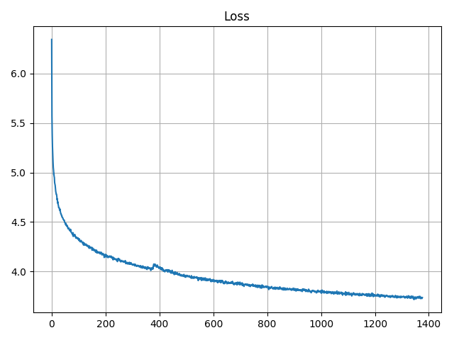

# Pytorch Simple Template
## File Structure

- Package
1. ``loader``: dataset and dataloader
2. ``models``: networks, loss and metrics
3. ``trainer``: training process, save records(checkpoint, results...)
4. ``utils``: frequently used functions, arguments
- Execution
1. ``train.py``: main train logic
2. ``test.py``: evaluation

## Performance
1. Training process

    The whole process takes around 20hrs.

    

2. Evaulation
```
perplexity: 7.486338 (baseline: < 100)
correlation score: 0.55515 (baseline: > 0.45)
```

## Dependency

```bash
numpy==1.15.4
gensim==3.6.0
tensorflow==1.6.0
matplotlib==3.0.1
torch==0.4.1
```

## Download model

TODO

## Execution
- Reproduce the results
```bash
python3 test.py --checkpoint <path1> --save_path <path2>
# example
python3 test.py --checkpoint xxx.pth --save_path result.txt
```

## Presentation slides
TODO

## Reference
- code structure: https://github.com/victoresque/pytorch-template
- seq2seq model: https://pytorch.org/tutorials/intermediate/seq2seq_translation_tutorial.html#the-seq2seq-model