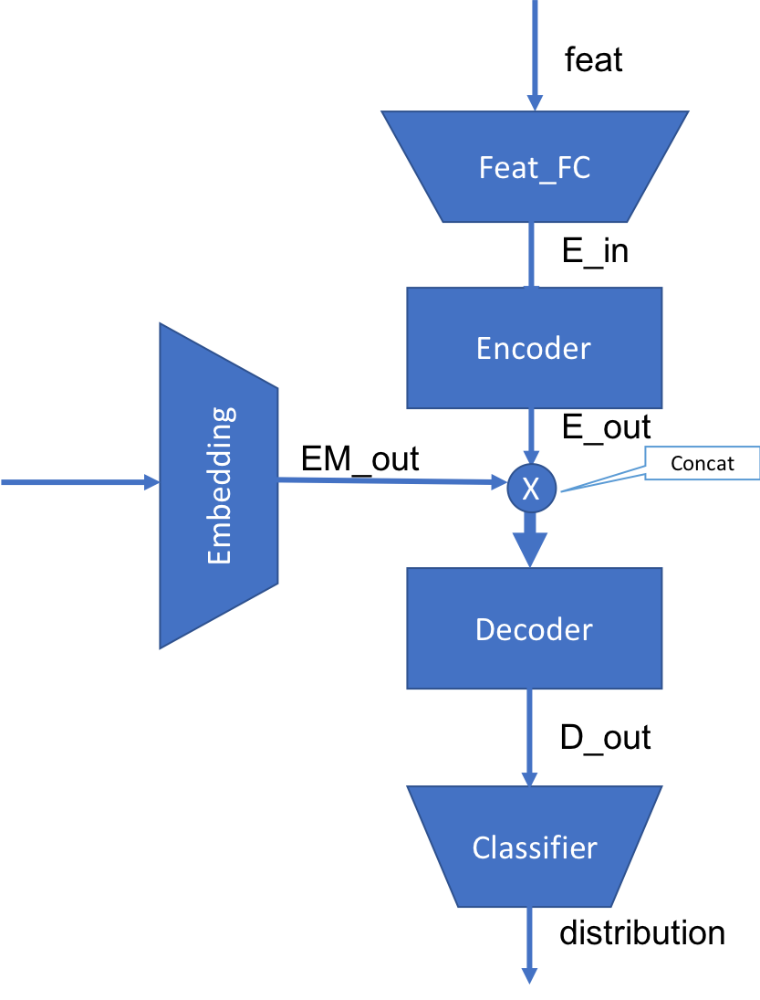

# Pytorch Simple Template
## File Structure
- Logic
Modules are only used together in root python file like ``train.py``.
They will not import each other.
- Package
1. ``loader``: dataset and dataloader
2. ``models``: networks, loss and metrics
3. ``trainer``: training process, save records(checkpoint, results...)
4. ``utils``: frequently used functions, arguments
- Execution
1. ``train.py``: main train logic
2. ``debug.py``: test each package independently
## Model Structure

## Reference
https://github.com/victoresque/pytorch-template