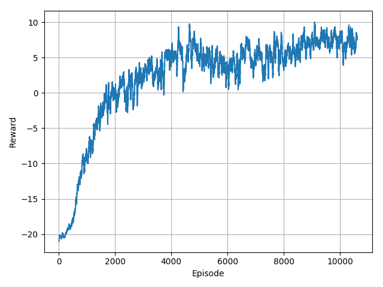
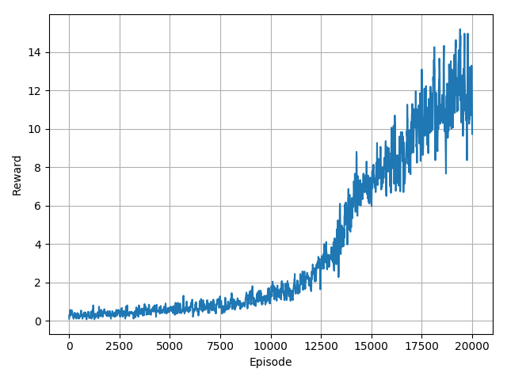

# MLDS HW4

## HW4-1
### 0. Demo


### 1. Model
```python
# GP
nn.Linear(80 * 80 * 1, 256),
nn.ReLU(True),
nn.Linear(256, 256),
nn.ReLU(True),
nn.Linear(256, 1),
nn.Sigmoid()

# DQN
nn.Conv2d(in_channels, 32, kernel_size=8, stride=4),
nn.ReLU(),
nn.Conv2d(32, 64, kernel_size=4, stride=2),
nn.ReLU(),
nn.Conv2d(64, 64, kernel_size=3, stride=1),
nn.ReLU(),
Flatten(),
nn.Linear(7*7*64, 512),
# Duel
fc_value = nn.Linear(512, 1)
fc_advantage = nn.Linear(512, action_num)
# Original
nn.Linear(512, action_num)
```
### 2. Plot

#### GP


#### DQN


### 3. Inference

```Bash
# GP
Run 30 episodes
Mean: 8.133333333333333
# DQN
Run 100 episodes 
Mean: 61.32
```

### 4. Execution

```bash
# For DQN
# For training
# --duel for duel-DQN
$ python3 main.py --train_dqn --duel
# For testing
$ python3 main.py --test_dqn --check_path saved/dqn.pth.tar
```